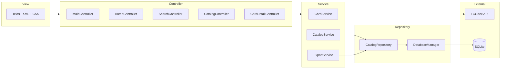
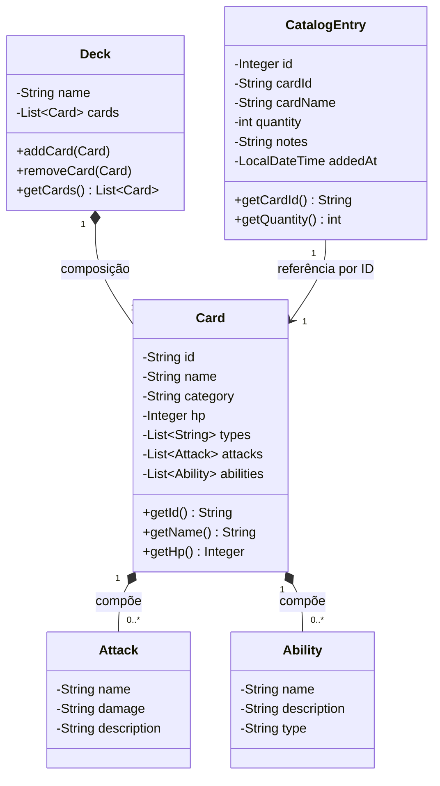

# 🎴 Pokémon TCG Catalog


> Aplicação desktop em Java para catalogar sua coleção de cartas Pokémon TCG, com busca online via [TCGdex API](https://tcgdex.dev/), armazenamento local em SQLite e exportação em CSV/JSON.

---

## 📋 Sobre o Projeto

O **Pokémon TCG Catalog** é uma aplicação desktop desenvolvida em **JavaFX** que permite ao colecionador:

- Pesquisar cartas de Pokémon utilizando a API pública **TCGdex**
- Visualizar detalhes completos de cada carta (ataques, habilidades, HP, raridade)
- Salvar cartas no seu **catálogo pessoal** com banco de dados local SQLite
- Exportar a coleção em formatos **CSV** e **JSON**

O projeto foi construído seguindo o padrão **MVC (Model-View-Controller)** e boas práticas de Engenharia de Software como separação de responsabilidades, testes automatizados e commits padronizados (Conventional Commits).

---

## 🎥 Demonstração

Confira o vídeo abaixo mostrando a interface e as funcionalidades da aplicação na prática:

[](https://youtu.be/ao_w_NYM-Oc)

---

## ✨ Funcionalidades

- 🔍 **Busca de Cartas** — Pesquisa por nome, categoria, tipo e raridade via API TCGdex
- 📄 **Detalhes Completos** — Modal com HP, ataques, habilidades, fraqueza, resistência e custo de recuo
- 💾 **Catálogo Pessoal** — Salve cartas no banco de dados local com quantidade e observações
- 📤 **Exportação** — Exporte sua coleção em CSV ou JSON
- 🖼️ **Cache de Imagens** — Imagens das cartas são armazenadas localmente para acesso offline
- 🎨 **Interface Moderna** — Design com glassmorphism, fontes customizadas e ícones vetoriais

---

## 🛠️ Stack Tecnológica

| Tecnologia | Versão | Finalidade |
|---|---|---|
| **Java (OpenJDK)** | 21 | Linguagem principal |
| **JavaFX** | 21.0.2 | Interface gráfica (GUI) |
| **Maven** | 3.9+ | Gerenciamento de dependências e build |
| **SQLite (JDBC)** | 3.45.3 | Banco de dados local embarcado |
| **TCGdex Java SDK** | 2.0.2 | Integração com API de cartas Pokémon |
| **Jackson** | 2.17.0 | Serialização/deserialização JSON |
| **OpenCSV** | 5.9 | Exportação de dados em CSV |
| **Ikonli** | 12.3.1 | Ícones vetoriais (Material Design + FontAwesome) |
| **JUnit 5** | 5.10.2 | Framework de testes unitários |
| **Mockito** | 5.11.0 | Mock de dependências nos testes |
| **JaCoCo** | 0.8.12 | Cobertura de testes |

---

## 🏗️ Arquitetura

O projeto segue o padrão **MVC** com camadas de serviço e repositório:



---

## 📐 Diagrama de Classes



---

## 📁 Estrutura de Pastas

```
PokemonTCG/
├── pom.xml                          # Configuração Maven
├── README.md
├── src/
│   ├── main/
│   │   ├── java/com/pokemontcg/
│   │   │   ├── Main.java                   # Ponto de entrada da aplicação
│   │   │   ├── model/                       # Entidades de domínio
│   │   │   │   ├── Card.java                # Dados da carta (API)
│   │   │   │   ├── CatalogEntry.java        # Dados da carta (catálogo local)
│   │   │   │   └── Deck.java                # Agrupamento de cartas
│   │   │   ├── controller/                  # Controladores JavaFX
│   │   │   │   ├── MainController.java      # Navegação principal
│   │   │   │   ├── HomeController.java      # Dashboard
│   │   │   │   ├── SearchController.java    # Busca de cartas
│   │   │   │   ├── CatalogController.java   # Visualização do catálogo
│   │   │   │   ├── CardDetailController.java # Modal de detalhes
│   │   │   │   ├── CardItemController.java  # Item individual na grid
│   │   │   │   └── CatalogRowController.java # Linha do catálogo
│   │   │   ├── service/                     # Lógica de negócio
│   │   │   │   ├── CardService.java         # Busca e cache de cartas
│   │   │   │   ├── CatalogService.java      # Gerenciamento do catálogo
│   │   │   │   └── ExportService.java       # Exportação CSV/JSON
│   │   │   ├── repository/                  # Acesso a dados
│   │   │   │   ├── CatalogRepository.java   # CRUD no SQLite
│   │   │   │   └── DatabaseManager.java     # Conexão e schema
│   │   │   ├── api/                         # Integração externa
│   │   │   │   ├── TcgDexClient.java        # Cliente HTTP para TCGdex
│   │   │   │   ├── CacheManager.java        # Cache em memória
│   │   │   │   └── PersistentImageCache.java # Cache de imagens em disco
│   │   │   ├── export/                      # Exportadores
│   │   │   │   ├── CsvExporter.java
│   │   │   │   └── JsonExporter.java
│   │   │   └── exception/                   # Exceções customizadas
│   │   │       ├── ApiException.java
│   │   │       ├── DatabaseException.java
│   │   │       └── ExportException.java
│   │   └── resources/
│   │       ├── css/styles.css               # Estilização da interface
│   │       ├── db/schema.sql                # Schema do banco de dados
│   │       ├── fonts/                       # Fontes customizadas
│   │       └── fxml/                        # Telas da aplicação
│   │           ├── main.fxml
│   │           ├── home.fxml
│   │           ├── search.fxml
│   │           ├── catalog.fxml
│   │           ├── export.fxml
│   │           └── components/
│   │               ├── card_detail_modal.fxml
│   │               ├── card_item.fxml
│   │               └── catalog_row.fxml
│   └── test/java/com/pokemontcg/          # Testes automatizados
│       ├── api/                             # Testes de API e cache
│       ├── controller/                      # Testes de integração
│       ├── export/                          # Testes de exportação
│       ├── repository/                      # Testes de repositório
│       └── service/                         # Testes de serviço
```

---

## ⚙️ Pré-requisitos

- **JDK 21** ou superior ([Download](https://adoptium.net/))
- **Maven 3.9+** ([Download](https://maven.apache.org/download.cgi))
- Conexão com a internet (para buscar cartas na API)

---

## 🚀 Como Executar

```bash
# 1. Clone o repositório
git clone https://github.com/Eliane-orlandin/PokemonTCG.git
cd PokemonTCG

# 2. Compile e execute a aplicação
mvn javafx:run
```

A aplicação abrirá uma janela com a interface gráfica do catálogo.

---

## 🧪 Testes

O projeto possui **13 classes de teste** cobrindo todas as camadas da aplicação:

```bash
# Executar todos os testes
mvn test

# Gerar relatório de cobertura (JaCoCo)
mvn test jacoco:report
# O relatório HTML será gerado em: target/site/jacoco/index.html
```

| Camada | Testes |
|---|---|
| **API** | `TcgDexClientTest`, `CacheManagerTest`, `CacheLimitTest` |
| **Service** | `CardServiceTest`, `CatalogServiceTest`, `ExportServiceTest`, `CardServiceResilienceTest`, `ExportServiceResilienceTest`, `ExportServiceIntegrationTest` |
| **Repository** | `CatalogRepositoryTest` |
| **Export** | `CsvExporterTest`, `JsonExporterTest` |
| **Controller** | `MainControllerIntegrationTest` |

---

## 📤 Exportação do Catálogo

Após adicionar cartas ao seu catálogo pessoal, você pode exportar a coleção:

- **CSV**: Gera um arquivo `.csv` compatível com Excel e Google Sheets
- **JSON**: Gera um arquivo `.json` estruturado para integração com outras ferramentas

A exportação é acessível pela tela de **Exportação** na barra lateral da aplicação.

---

## 👩‍💻 Autora

Desenvolvido por **Eliane Orlandin**

[](https://github.com/Eliane-orlandin)

---

## 📄 Licença

Este projeto está sob a licença MIT. Consulte o arquivo [LICENSE](LICENSE) para mais detalhes.
